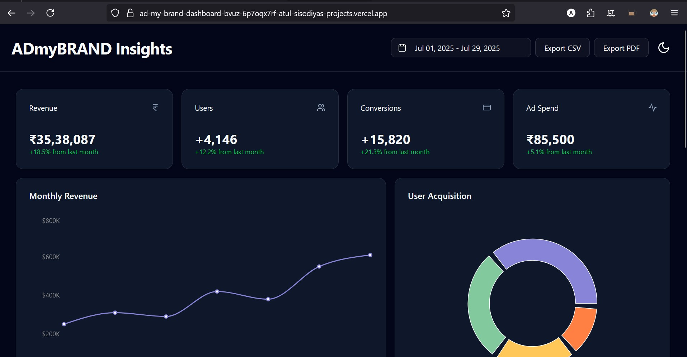

# ADmyBRAND Insights - Analytics Dashboard

   

A modern, responsive analytics dashboard built for a fictional digital marketing platform. This project showcases key business metrics through interactive charts, a filterable data table, and a beautiful, theme-aware UI. The data, currency (₹), and theming are localized for an Indian business context.

###  [Live Demo](https://ad-my-brand-dashboard-bvuz-6p7oqx7rf-atul-sisodiyas-projects.vercel.app/)

---

##  Features

- **Fully Responsive Design:** Optimized for desktop, tablet, and mobile with an intelligent, adaptive layout.
- **Light & Dark Mode:** Seamless theme switching with a dedicated toggle.
- **Interactive Charts:**
    - **Line Chart:** For tracking monthly revenue trends.
    - **Donut Chart:** For visualizing user acquisition channels.
    - **Horizontal Bar Chart:** For comparing sales data across different cities.
- **Interactive Data:**
    - **Drill-Down Filtering:** Click on the "Sales by City" chart to dynamically filter the "Recent Sales" list.
    - **Simulated Real-Time Updates:** Key Performance Indicator (KPI) cards animate with new data every few seconds to feel live.
- **Data Management:**
    - **Advanced Data Table:** A comprehensive user table with sorting, filtering, and pagination.
    - **Date Range Filtering:** A date picker to filter dashboard data.
    - **Export Functionality:** Download table data as a **CSV** or **PDF** file.
- **Modern UI/UX:**
    - Built with the elegant **shadcn/ui** component library.
    - **Tabbed Interface:** To cleanly organize related content and save space.
    - **Loading Skeletons:** Professional loading state for an enhanced user experience.

## Tech Stack

- **Framework:** [Next.js](https://nextjs.org/) 14+ (App Router)
- **Language:** [TypeScript](https://www.typescriptlang.org/)
- **Styling:** [Tailwind CSS](https://tailwindcss.com/)
- **UI Components:** [shadcn/ui](https://ui.shadcn.com/)
- **Charting:** [Recharts](https://recharts.org/)
- **Data Table:** [TanStack Table](https://tanstack.com/table)
- **Deployment:** [Vercel](https://vercel.com/)


*(**Note:** To add a screenshot, take a picture of your live application, name it `screenshot.png`)*

## Getting Started

To get a local copy up and running, follow these simple steps.

### Prerequisites

Make sure you have Node.js (v18 or later) installed on your machine.

### Installation

1.  **Clone the repository:**
    ```bash
    git clone [https://github.com/YOUR_USERNAME/admybrand-insights-dashboard.git](https://github.com/YOUR_USERNAME/admybrand-insights-dashboard.git)
    ```
2.  **Navigate to the project directory:**
    ```bash
    cd admybrand-insights-dashboard
    ```
3.  **Install dependencies:**
    ```bash
    npm install
    ```
4.  **Run the development server:**
    ```bash
    npm run dev
    ```

Open [http://localhost:3000](http://localhost:3000) with your browser to see the result.

## 🤖 AI Collaboration

This entire project was built through a conversational development process with **Google's Gemini AI Pro 2.5** and using **Cursor**. The process involved step-by-step guidance, complete component generation, feature implementation, and iterative debugging to arrive at the final, polished product.

---
